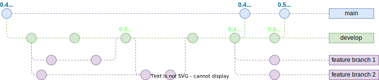

# Gen IR Branching Model

Gen IR uses the [GitFlow](https://nvie.com/posts/a-successful-git-branching-model/) branching model. This model is tried, tested, and has remained so over 10+ years for a project of this type.

Modifications to the model:

- No `hotfix` branch for now. We can just follow the regular release flow
- Unstable releases are tagged on `develop`
  - These should be set as `prelease` in the GitHub Release!

## Versioning

We use the [SemVar 2.0.0](https://semvar.org) versioning scheme.

Releases should increment this (see [Releasing an Update](releasing_an_update.md))

## New Feature Development

- Create a new branch off `develop` and name it appropriately
  - `git checkout develop && git pull && git checkout -b sensibly_named_branch`
- Add your new feature commits
- Create a merge request to the `develop` branch

## New Release

- Create a branch off `develop` and name it `release/<version>`
- Test, QA, fix
- Merge to `main` and create a release
- Merge to `develop`, remove the `develop` tag and retag the new commit with `develop`
