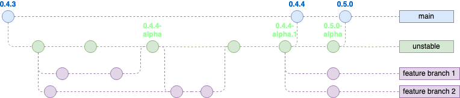

# Gen IR Branching Model

Gen IR uses a modified version of [GitFlow](https://nvie.com/posts/a-successful-git-branching-model/) as the basis of it’s branching model. This model is tried, tested, and has remained so over 10+ years for a project of this type.

Modifications to the model:

- `develop` becomes `unstable`
- No `hotfix` branch for now. We can just follow the regular flow
- Unstable releases are tagged on `unstable` if and when we want to make a new release
  - These should be set as `prelease` in the GitHub Release!

## Versioning

We use the [SemVar 2.0.0](https://semvar.org) versioning scheme.

Releases should increment this (see [Releasing an Update](releasing_an_update.md))

## New Feature Development

- Create a new branch off `unstable` and name it appropriately
  - `git checkout unstable && git pull && git checkout -b sensibly_named_branch`
- Add your new feature commits
- Create a merge request to the `unstable` branch

### Unstable releases

If a feature should be released for testing & early adopters, you will need to do some additional steps. See [Releasing an Update - Unstable](releasing_an_update.md#unstable) for more.
